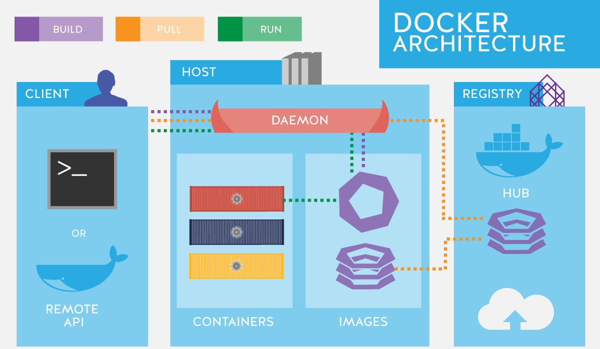

# Docker

... EN DESARROLLO ...

<!-- markdownlint-disable MD033 -->
<p align="center">
  <a href="https://alxgcrz.com" target="_blank">
    
  </a>
</p>
<!-- markdownlint-enable MD033 -->

## Overview

Docker permite empaquetar las aplicaciones en **contenedores** que incluyen todo lo neceario para que se puedan ejecutar en un entorno de manera aislada. Cada contenedor almacena el código fuente de la aplicación, los archivos de configuración y todas las dependencias software que necesita. Esta estrategia permite que las aplicaciones se puedan ejecutar de la misma manera sobre cualquier infraestructura que tenga soporte para Docker, tanto de forma local como en la nube.

Con la tecnología de contenedores para aplicaciones, ya no es necesario preocuparse por el software que está instalado en la máquina donde se ejecuta el contenedor, porque todo lo que necesita la aplicación está incluido dentro del propio contenedor. Esta forma de trabajar resuelve el problema de 'it works on my machine', donde una aplicación puede funcionar correctamente en el entorno de desarrollo, pero tiene errores en el entorno de producciónm, porque los dos entornos no son idénticos y contienen versiones de software diferentes.

Cada vez hay más equipos de desarrollo y operaciones que están utilizando la tecnología de contenedores Docker en sus flujos de trabajo. Esto ha permitido acelerar el proceso de desarrollo de las aplicaciones, ha facilitado la forma de distribuirlas y ha acelerado la automatización del despliegue en producción.

### Máquina virtual vs contenedor

Una **máquina virtual (VM)** es un entorno que emula la misma funcionalidad de una máquina física. Una máquina virtual hace uso de los recursos que se le hayan asignado, como por ejemplo su propia CPU, memoria, interfaz de red, almacenamiento y su propio sistema operativo.

Las máquinas virtuales (VM) se crean y se ejecutan sobre un software llamado **hipervisor** o **_virtual machine monitor_ (VMM)**. El hipervisor se ejecuta sobre la máquina física y actúa como una capa intermedia entre el hardware de la máquina anfitriona o _'host'_ y la máquina virtual. El hipervisor se encarga de gestionar y distribuir los recursos de la máquina física entre las máquinas virtuales.

Es posible crear varias máquinas virtuales sobre una misma máquina física. Cada una de las máquinas virtuales estará aislada del resto, tendrá sus propios recursos y contará con su **propio sistema operativo**, que no tiene por qué ser el mismo que el de la máquina anfitriona.

Un **contenedor** se puede definir como una unidad estándar de software que permite empaquetar el código fuente de una aplicación y todas sus dependencias, para que se pueda distribuir y ejecutar de forma rápida y fiable en diferentes entornos.

También se puede definir como un proceso que ha sido aislado de todos los demás procesos de la máquina anfitriona donde se está ejecutando. Aunque es posible tener más de un proceso en un contenedor, las buenas prácticas nos recomiendan ejecutar solo un proceso por contenedor.

Los contenedores deben cumplir con los entándares abiertos de la industria de los contenedores software desarrollados por la **OCI (_Open Container Initiative_)**.

La **principal diferencia** entre una máquina virtual y un contenedor es que la máquina virtual necesita un sistema operativo completo para poder funcionar mientras que un contenedor no lo necesita ya que comparte el kernel del sistema operativo de la máquina donde se está ejecutando.

Por tanto, los contenedores necesitan menos recursos que las máquinas virtuales. Con el mismo hardware es posible tener un mayor número de contenedores que de máquinas virtuales.

Además, los contenedores son más livianos y arrancan más rápido que las máquinas virtuales.

Por último, un contenedor se puede ejecutar **dentro** de una máquina virtual pero no al revés.

## La arquitectura Docker

La arquitectura Docker fue diseñada de forma monólitica en un principio, pero más tarde fue rediseñada a una **arquitectura modular**, formada por diferentes componentes que pueden ser reemplazados e incluso utilizarse en otros proyectos.

Cada uno de los componentes de Docker se desarrolla por separado y muchos de ellos forman parte del [proyecto Moby](https://mobyproject.org/), que es un proyecto _open source_ creado por la compañía Docker Inc en 2017, donde se desarrollan componentes y herramientas que pueden ser utilizados para crear productos basados en la tecnología de contenedores.

Los principales componentes de Docker que debemos conocer son:

- Cliente Docker
  - Docker CLI
  - Docker Compose
- Docker Engine
  - Docker Engine API
  - Docker Daemon
- Container Runtime
  - Containerd
  - Runc
- Docker Registry

<!-- markdownlint-disable MD033 -->
<p align="center">
    
</p>
<!-- markdownlint-enable MD033 -->

### Cliente Docker

Docker utiliza una arquitectura **cliente-servidor**, donde una aplicación cliente interactúa con un servicio llamado **_Docker daemon_**. Un mismo cliente puede comunicarse con más de un servicio **_Docker daemon_**.

La comunicación entre cliente y servidor se realiza a través de una API HTTP conocida como **_Docker Engine API_**.

Las aplicaciones oficiales que se pueden utilizar como cliente son **Docker CLI (_Command Line Interface_)** y **Docker Compose** aunque cualquier aplicación cliente que haga uso de la API de Docker Engine puede ser un cliente válido.

El cliente y el servidor se pueden ejecutar en la **misma máquina** o pueden estar en **máquinas separadas**. Cuando están en la misma máquina la comunicación entre ambos se realiza a través de un **socket IPC** o un **socket TCP** mientras que cuando se encuentran en máquinas separadas la comunicación se realiza mediante un **socket TCP**.

#### Docker CLI

**Docker CLI** es el cliente oficial de Docker. Es una interfaz de línea de comandos que permite a los usuarios interaccionar con el servicio **_Docker daemon_**.

```sh
# Muestra la ayuda de Docker
$ docker help
```

El uso más habitual de **Docker CLI** es cuando se quiere interactuar con un **único contenedor**.

#### Docker Compose

**Docker Compose** es una aplicación utilizada desde línea de comandos y permite a los usuarios interaccionar con el servicio **_Docker daemon_**.

```sh
# Muestra la ayuda de Docker Compose
$ docker compose help
```

Esta aplicación permite definir y ejecutar aplicaciones con **múltiples contenedores**. Utiliza un archivo de configuración con formato YAML para definir los servicios, las redes y los volúmenes de los que consta la aplicación que queremos ejecutar.

Una de las ventajas que nos ofrece **Docker Compose** es que solo hay que ejecutar un comando para crear y ejecutar todos los servicios que se han definido en el archivo YAML de configuración.

En la actualidad hay dos versiones de **Docker Compose**:

- **v1**: tiene que ser instalada como herramienta adicional y se ejecuta con `docker-compose`
- **v2**: integra el comando `compose` dentro del cliente oficial de Docker CLI. Por lo tanto la nueva versión se ejecuta con `docker compose`

### Docker Engine

**Docker Engine** es el componente principal de Docker, encargado de crear, ejecutar y gestionar contenedores.

Tiene un diseño modular y está formado por varios componentes que cumplen con los estándares abiertos de la **OCI (_Open Container Initiative_)**:

- Docker Engine API
- Docker daemon (**componente principal**)
- Container runtime (_containerd_)
- Gestión de redes (_libnetwork_)
- Creación de imágenes (_buildkit_)
- Interacción con los registros de contenedores (_distribution_)
- Soporte nativo para la orquestación de contenedores con Docker Swarm (_swarmkit_)
- Gestión de plugins

:warning: **Nota**: son proyectos que cumplen los estándares abiertos y están alojados en [Moby Project](https://mobyproject.org/projects/).

**Docker Engine** se ejecuta de forma nativa en los sistemas Linux y Windows Server. En el resto de los sistemas operativos de Windows y en los sistemas Mac se ejecuta sobre una máquina virtual Linux.

#### Docker Engine API

(TODO)

#### Docker daemon

(TODO)

#### Container runtime

##### _containerd_

(TODO)

##### _runc_

(TODO)

### Docker Registry

(TODO)

## Appendix: Common Docker Commands

### IMAGES

Docker images are a lightweight, standalone, executable package of software that includes everything needed to run an application: code, runtime, system tools, system libraries and settings

```bash
# Build an image
> docker image build --rm=true .

# Install an image:
> docker image pull ${IMAGE}

# List of installed images:
> docker image ls
 
# List of installed images (detailed listing):
> docker image ls --no-trunc

# Remove an image:
> docker image rm ${IMAGE_ID}

# Remove unused images:
> docker image prune

# Remove all images:
> docker image rm $(docker image ls -aq)

# Para listar las instrucciones usadas en la creación de la imagen:
> docker image history ${IMAGE_ID}
```

### CONTAINERS

```bash
# Run a container:
> docker container run

# List of running containers:
> docker container ls

# List of all containers:
> docker container ls -a(--all)

# Stop a container:
> docker container stop ${CONTAINER_ID}

# Stop all running containers:
> docker container stop $(docker container ls -q)

# List all exited containers with status 1:
> docker container ls -a --filter "exited=1"

# Remove a container:
> docker container rm ${CONTAINER_ID}

# Remove container by a regular expression:
> docker container ls -a | grep wildfly | awk '{print $1}' | xargs docker container rm -f

# Remove all exited containers:
> docker container rm -f $(docker container ls -a | grep Exit | awk '{ print $1 }')

# Remove all containers:
> docker container rm $(docker container ls -aq)

# Find IP address of the container:
> docker container inspect --format '{{ .NetworkSettings.IPAddress }}' ${CONTAINER_ID}

# Attach to a container:
> docker container attach ${CONTAINER_ID}

# Open a shell into a container:
> docker container exec -it ${CONTAINER_ID} bash

# Get container id for an image by a regular expression:
> docker container ls | grep wildfly | awk '{print $1}'
```

### VOLUME

```bash
# Eliminar volúmenes huérfanos (_'dangling'_)
> docker volume rm $(docker volume ls -qf dangling=true)
```

### OTHERS

```bash
# Limpieza general del sistema:
> docker system prune

# Show version
> docker --version

# Show client and server version:
> docker version

# Start the daemon manually
> dockerd
```

---

## Enlaces de interés

- <https://docs.docker.com/>
- <https://docs.docker.com/language/java/>
- <https://roadmap.sh/docker>
- <https://github.com/veggiemonk/awesome-docker>
- <https://github.com/wsargent/docker-cheat-sheet/tree/master/es-es>
- <https://github.com/collabnix/dockerlabs/blob/master/docker/cheatsheet/README.md>
- <https://containerd.io/>
- <https://mobyproject.org/>

## Licencia

[](http://creativecommons.org/licenses/by-sa/4.0/)
Esta obra está bajo una [licencia de Creative Commons Reconocimiento-Compartir Igual 4.0 Internacional](http://creativecommons.org/licenses/by-sa/4.0/).
